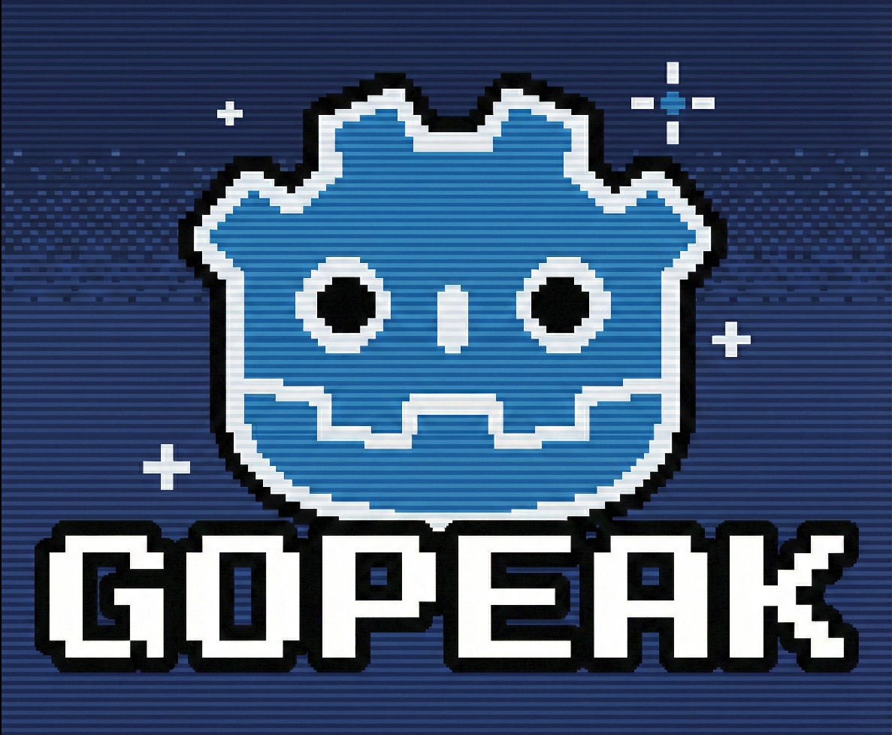
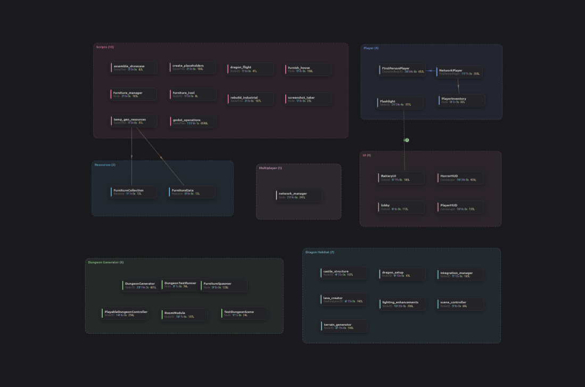

# GoPeak

[](https://modelcontextprotocol.io/introduction)
[](https://godotengine.org)
[](https://nodejs.org/en/download/)
[](https://www.typescriptlang.org/)
[](https://www.npmjs.com/package/gopeak)
[](https://github.com/HaD0Yun/godot-mcp/commits/main)
[](https://github.com/HaD0Yun/godot-mcp/stargazers)
[](https://github.com/HaD0Yun/godot-mcp/network/members)
[](https://opensource.org/licenses/MIT)



**GoPeak is an MCP server for Godot that lets AI assistants run, inspect, modify, and debug real projects end-to-end.**

---

## Quick Start (3 Minutes)

### Requirements

- Godot 4.x
- Node.js 18+
- MCP-compatible client (Claude Desktop, Cursor, Cline, OpenCode, etc.)

### 1) Run GoPeak

```bash
npx -y gopeak
```

or install globally:

```bash
npm install -g gopeak
gopeak
```

### 2) Add MCP client config

```json
{
  "mcpServers": {
    "godot": {
      "command": "npx",
      "args": ["-y", "gopeak"],
      "env": {
        "GODOT_PATH": "/path/to/godot",
        "GOPEAK_TOOL_PROFILE": "compact"
      }
    }
  }
}
```

> `GOPEAK_TOOL_PROFILE=compact` is the default. It keeps prompt/tool-list token usage low while preserving access to the full toolset via catalog discovery.

### 3) First prompts to try

- "List Godot projects in `/your/projects` and show project info."
- "Create `scenes/Player.tscn` with `CharacterBody2D` root and add a movement script."
- "Run project, get debug output, then fix top error."

---

## Why GoPeak

- **Real project feedback loop**: run the game, inspect logs, and fix in-context.
- **95+ tools available** across scene/script/resource/runtime/LSP/DAP/input/assets.
- **Token-efficient by default**: compact tool surface for lower context overhead.
- **Discoverability built-in**: use `tool.catalog` (alias of `tool_catalog`) to find hidden or legacy tools by keyword.
- **Deep Godot integration**: ClassDB queries, runtime inspection, debugger hooks, bridge-based scene/resource edits.

### Best For

- Solo/indie developers moving quickly with AI assistance
- Teams that need AI grounded in actual project/runtime state
- Debug-heavy workflows (breakpoints, stack traces, live runtime checks)

---

## Tool Surface Model (Important)

GoPeak supports three exposure profiles:

- `compact` (default): exposes a curated alias set (about 20 core tools)
- `full`: exposes full legacy tool list (95+)
- `legacy`: same exposed behavior as `full`

Configure with either:

- `GOPEAK_TOOL_PROFILE`
- `MCP_TOOL_PROFILE` (fallback alias)

### How to discover hidden tools in compact mode

Call:

- `tool.catalog` (compact alias)
- `tool_catalog` (legacy name)

Example intent:

> "Use `tool.catalog` with query `animation` and show relevant tools."

This lets assistants start with a small, efficient default surface but still find and use the full capability set when needed.

---

## Installation Options

### A) Recommended: npx

```bash
npx -y gopeak
```

### B) Global install

```bash
npm install -g gopeak
gopeak
```

### C) From source

```bash
git clone https://github.com/HaD0Yun/godot-mcp.git
cd godot-mcp
npm install
npm run build
node build/index.js
```

GoPeak also exposes two CLI bin names:

- `gopeak`
- `godot-mcp`

---

## Addons (Recommended)

### Auto Reload + Runtime Addon installer

Install in your Godot project folder:

```bash
curl -sL https://raw.githubusercontent.com/HaD0Yun/godot-mcp/main/install-addon.sh | bash
```

PowerShell:

```powershell
iwr https://raw.githubusercontent.com/HaD0Yun/godot-mcp/main/install-addon.ps1 -UseBasicParsing | iex
```

Then enable plugin in **Project Settings → Plugins**.

---

## Core Capabilities

- **Project control**: launch editor, run/stop project, capture debug output
- **Scene editing**: create scenes, add/delete/reparent nodes, edit properties
- **Script workflows**: create/modify scripts, inspect script structure
- **Resources**: create/modify resources, materials, shaders, tilesets
- **Signals/animation**: connect signals, build animations/tracks/state machines
- **Runtime tools**: inspect live tree, set properties, call methods, metrics
- **LSP + DAP**: diagnostics/completion/hover + breakpoints/step/stack trace
- **Input + screenshots**: keyboard/mouse/action injection and viewport capture
- **Asset library**: search/fetch CC0 assets (Poly Haven, AmbientCG, Kenney)

### Tool families (examples)

| Area | Examples |
|---|---|
| Project | `project.list`, `project.info`, `editor.run` |
| Scene/Node | `scene.create`, `scene.node.add`, `set_node_properties` |
| Script | `script.create`, `script.modify`, `script.info` |
| Runtime | `runtime.status`, `inspect_runtime_tree`, `call_runtime_method` |
| LSP/DAP | `lsp.diagnostics`, `lsp_get_hover`, `dap_set_breakpoint`, `dap.output` |
| Input/Visual | `inject_key`, `inject_mouse_click`, `capture_screenshot` |

---

## Project Visualizer

Visualize your entire project architecture with `visualizer.map` (`map_project` legacy). Scripts are grouped by folder structure into color-coded categories.



---

## Quick Prompt Examples

### Build
- "Create a Player scene with CharacterBody2D, Sprite2D, CollisionShape2D, and a basic movement script."
- "Add an enemy spawner scene and wire spawn signals to GameManager."

### Debug
- "Run the project, collect errors, and fix the top 3 issues automatically."
- "Set a breakpoint at `scripts/player.gd:42`, continue execution, and show stack trace when hit."

### Runtime testing
- "Press `ui_accept`, move mouse to (400, 300), click, then capture a screenshot."
- "Inspect live scene tree and report nodes with missing scripts or invalid references."

### Discovery in compact mode
- "Use `tool.catalog` with query `tilemap` and list the most relevant tools."
- "Find import pipeline tools with `tool.catalog` query `import` and run the best one for texture settings."

---

## Technical Reference

### Environment variables

| Name | Purpose | Default |
|---|---|---|
| `GOPEAK_TOOL_PROFILE` | Tool exposure profile: `compact`, `full`, `legacy` | `compact` |
| `MCP_TOOL_PROFILE` | Fallback profile env alias | `compact` |
| `GODOT_PATH` | Explicit Godot executable path | auto-detect |
| `DEBUG` | Enable server debug logs (`true`/`false`) | `false` |
| `MCP_HEALTH_PORT` | Health endpoint port | `8080` |
| `LOG_MODE` | Recording mode: `lite` or `full` | `lite` |

### Ports

| Port | Service |
|---|---|
| `6505` | Unified Godot Bridge + Visualizer server |
| `6005` | Godot LSP |
| `6006` | Godot DAP |
| `7777` | Runtime addon command socket |
| `8080` | Health endpoint (default) |

---

## Troubleshooting

- **Godot not found** → set `GODOT_PATH`
- **No MCP tools visible** → restart your MCP client
- **Project path invalid** → confirm `project.godot` exists
- **Runtime tools not working** → install/enable runtime addon plugin
- **Need a tool that is not visible** → run `tool.catalog` and search by capability keyword

---

## Docs & Project Links

- [CHANGELOG](CHANGELOG.md)
- [ROADMAP](ROADMAP.md)
- [CONTRIBUTING](CONTRIBUTING.md)

---

## License

MIT — see [LICENSE](LICENSE).

## Credits

- Original MCP server by [Coding-Solo](https://github.com/Coding-Solo/godot-mcp)
- GoPeak enhancements by [HaD0Yun](https://github.com/HaD0Yun)
- Project visualizer inspired by [tomyud1/godot-mcp](https://github.com/tomyud1/godot-mcp)
